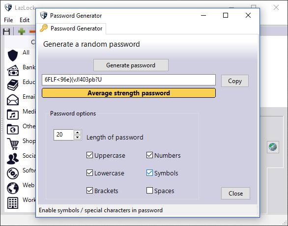

# LazLock

## Introduction

LazLock is a lightweight, portable password manager that runs on both Windows and GNU/Linux.
It doesn't need to be installed on your computer, so can be run from a USB stick. Carry both the Windows and the Linux versions with you and you'll be able to access your passwords from any PC.
It also has an option to create strong, random passwords for all of the websites that you visit, you only need to remember one password to unlock them all.
Your data is strongly protected with 128 bit AES encryption.

LazLock was previously featured in [Linux Format](https://www.linuxformat.com/) magazine. ([Read the article online](https://pressreader.com/article/282187946414121))

## Features
* 128 bit AES encryption
* Portable application with no need to install
* Simple interface
* Fast decryption on the fly
* Cross platform
* A plain text version of your data is never written to disk as all decryption is done in memory.

## Built With

* [Lazarus](https://sourceforge.net/projects/lazarus/) - RAD tool for Free Pascal
* [Free Pascal](https://www.freepascal.org/) - Object Pascal

## Author

* **Chris Hawkins**

## License

This project is licensed under the MIT License

## Acknowledgments

* Aleksandra Hawkins
* Gustavo Carreno
